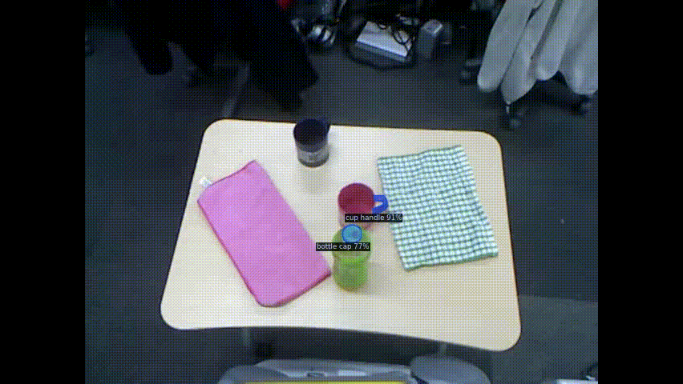

# deep_vision_ros  [](https://github.com/ojh6404/deep_vision_ros/actions/workflows/python_check.yml)

ROS1 package for SOTA Computer Vision Models including [SAM](https://github.com/facebookresearch/segment-anything.git), [Cutie](https://github.com/hkchengrex/Cutie.git), [GroundingDINO](https://github.com/IDEA-Research/GroundingDINO.git), [DEVA](https://github.com/hkchengrex/Tracking-Anything-with-DEVA.git), [VLPart](https://github.com/facebookresearch/VLPart.git) and [MaskDINO](https://github.com/IDEA-Research/MaskDINO.git).

## Usage
Tested : image of 480X640 30hz, 3090ti
### Interactive prompt for generating mask and tracking object using SAM and Cutie.


sam_node publishes segmentation prompt which is used by cutie_node to track objects. It runs almost real-time (~30hz).
### Detecting and tracking object using SAM, GroundingDINO and DEVA.


deva_node queries objects GroundingDINO and SAM at some intervals, so it can track new object after tracking is started. It runs ~15hz and you can adjust `cfg['detection_every']` for performance.
See [`node_scripts/model_config.py`](node_scripts/model_config.py)

### Part detection and segmentation using VLPart.


## Setup

### Prerequisite
This package is build upon
- ROS1 (Noetic)
- python3.9, python3.9-dev, python3.9-venv
- catkin virtualenv (python>=3.9 used for DEVA)
- Nvidia Driver>=530 (for cuda-12.1)
- (Optional) docker and nvidia-container-toolkit (for environment safety)

### Build package

#### on your workspace
If you want build this package directly on your workspace, please be aware of python environment dependencies (python3.9 and pytorch is needed to build package).
```bash
mkdir -p ~/ros/catkin_ws/src && cd ~/ros/catkin_ws/src
git clone https://github.com/ojh6404/deep_vision_ros.git
wstool init
wstool merge -t . deep_vision_ros/deep_vision_ros/rosinstall.noetic
wstool update -t . # jsk-ros-pkg/jsk_visualization for GUI
cd deep_vision_ros/deep_vision_ros && ./prepare.sh
cd ~/ros/catkin_ws && catkin b
```

#### using anaconda (Recommended)
You can build ROS package with anaconda environment.
```bash
sudo apt-get install libxml2-dev libxslt-dev libopenblas-dev libspatialindex-dev freeglut3-dev libsuitesparse-dev libblas-dev liblapack-dev libxcb-cursor0
conda create -n ros-env python=3.9 -y
conda activate ros-env
pip install psutil==5.5.1 empy==3.3.2 rospkg gnupg pycryptodomex catkin-tools wheel cython # for ROS build
mkdir -p ~/ros/catkin_ws/src && cd ~/ros/catkin_ws/src
git clone https://github.com/ojh6404/deep_vision_ros.git
wstool init
wstool merge -t . deep_vision_ros/deep_vision_ros/rosinstall.noetic
wstool update -t . # jsk-ros-pkg/jsk_visualization for GUI
cd deep_vision_ros/deep_vision_ros && ./prepare.sh
cd ~/ros/catkin_ws && catkin b
```

#### using docker (Recommended)
Otherwise, you can build only `deep_vision_ros_utils` package for using intractive prompt gui
```bash
mkdir -p ~/ros/catkin_ws/src && cd ~/ros/catkin_ws/src
git clone https://github.com/ojh6404/deep_vision_ros.git
wstool init
wstool merge -t . deep_vision_ros/deep_vision_ros/rosinstall.noetic
wstool update -t . # jsk-ros-pkg/jsk_visualization for GUI
cd ~/ros/catkin_ws && catkin b deep_vision_ros_utils
```
and build whole package on docker environment.
```bash
source ~/ros/catkin_ws/devel/setup.bash
roscd deep_vision_ros_utils/../deep_vision_ros
docker build -t deep_vision_ros .
```

## How to use
Please refer sample_track.launch and deva.launch
### Tracking using SAM and Cutie with interactive gui prompt.
#### 1. run directly
```bash
roslaunch deep_vision_ros sample_track.launch \
    input_image:=/kinect_head/rgb/image_rect_color \
    mode:=prompt \
    model_type:=vit_t \
    device:=cuda:0
```
#### 2. using docker
You need to launch tracker and gui seperately cause docker doesn't have gui, so launch tracker by
```bash
./run_docker -cache -host pr1040 -launch track.launch \
    input_image:=/kinect_head/rgb/image_rect_color \
    mode:=prompt \
    model_type:=vit_t \
    device:=cuda:0
```
where
- `-host` : hostname like `pr1040` or `localhost`
- `-launch` : launch file name to run
- `-cache` : caching downloaded checkpoints

and launch rqt gui on your gui machine by
```bash
roslaunch deep_vision_ros_utils sam_gui.launch
```

### Detecting and tracking object.
```bash
roslaunch deep_vision_ros deva.launch \
    input_image:=/kinect_head/rgb/image_rect_color \
    model_type:=vit_t \
    device:=cuda:0
```
or
```bash
./run_docker -cache -host pr1040 -launch deva.launch \
    input_image:=/kinect_head/rgb/image_rect_color \
    dino_model_type=swinb \    
    sam_model_type:=vit_t \
    device:=cuda:0
```
and use dynamic reconfigure to set detection and object tracking by
```bash
rosrun dynamic_reconfigure dynparam set /deva_node classes "cloth; cup; bottle;"
```

### Detecting and Segmentation using VLPart.
```bash
roslaunch deep_vision_ros vlpart_segment.launch \
    input_image:=/kinect_head/rgb/image_rect_color \
    vocabulary:=custom \
    classes:="cup handle; bottle cap;" \
    device:=cuda:0
```
or
```bash
./run_docker -cache -host pr1040 -launch vlpart_segment.launch \
    input_image:=/kinect_head/rgb/image_rect_color \
    vocabulary:=custom \
    classes:="cup handle; bottle cap;" \
    device:=cuda:0
```

### TODO
- add rostest and docker build test
- add [CoTracker](https://github.com/facebookresearch/co-tracker.git) and [Track Any Point](https://github.com/google-deepmind/tapnet.git).
